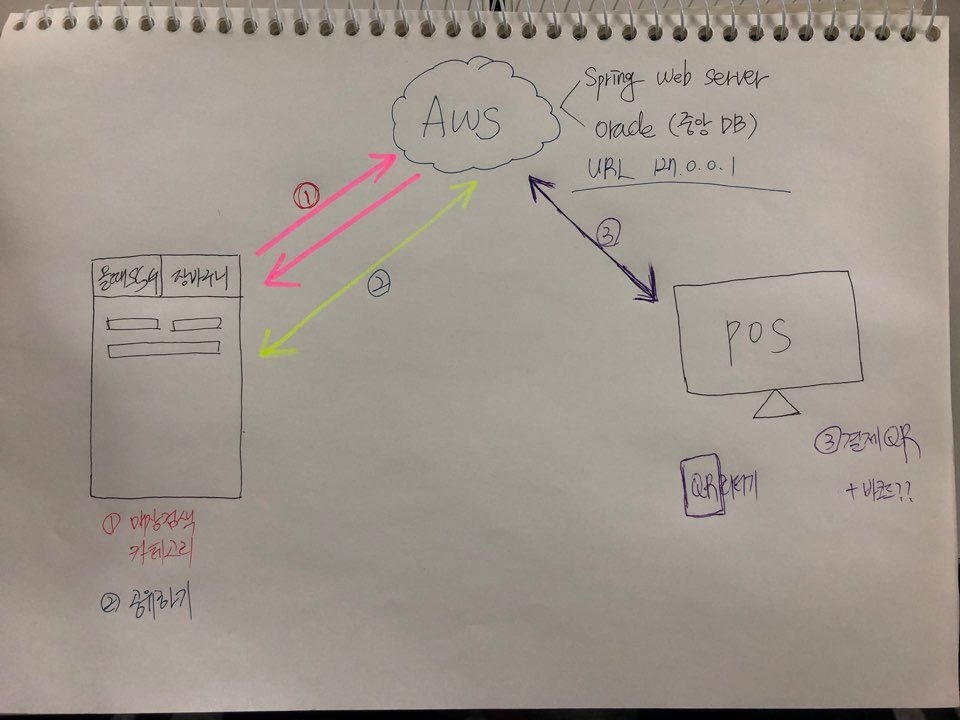

# Welcome to 쓱담조's Project!

## 쓱마트 프로젝트를 진행하는 2조 쓱담조입니다.

### 반드시 5가지는 지켜주세요!

#### 1. Trello에 업무 진행 후 반드시 업데이트 할 것

- 업무 예정 -> 하는 중 -> 완료
- 만약 동료가 해야할 일을 하지 못한 경우 챙겨주세요!

#### 2. 각 업무에 맞는 공간에 업데이트 할 것

- 업무 진행과정 Trello에 업데이트
- 코딩관련된 업무는 Github에 업데이트
- 발표관련 자료는 Google Drive에 업데이트

#### 3. 코딩 시 MVC 패턴을 유지하고, 각 클래스 및 메소드를 깔끔하게 정리해주세요.

- MVC패턴으로 통일하여 전체적으로 이해하기 쉬운 구조로 만듭시다.

#### 4. 코딩 시 각 클래스 및 메소드에 주석을 첨부하여 해당 클래스 및 메소드에 대한 설명을 첨부해주세요.

- 추후 모듈간에 연결, 시스템 구성도 제작 등에 용이하게 쓰일거에요!

#### 5. 클래스명 및 메소드명, Table명 등을 통일성있게 해주세요

- 클래스는 첫글자부터 대문자 
  - ex) ExceptionDemo.java / OracleMain.java
- 메소드명, 변수명은 낙타표기법
  - 메소드 ex) runThread / createNumberAndName
  - 변수 ex) strAry / numberFlag
- 테이블명 및 컬럼은 모두 대문자로

### git 넣는 법

* 폴더에 들어가서 마우스 오른쪽 클릭 후 git bash here
* git pull https://github.com/jshjsh06/ssgmart.git
* git status --> red line 확인
* git add * --> 초록색 바꿈
* git status --> green line 확인
* git commit -m "메세지 아무거나"
* git push origin master

### 시스템 전체 구성도

### 그리게 될 전체 구성도 예시

### 각각 담당해야할 구성도 예시

